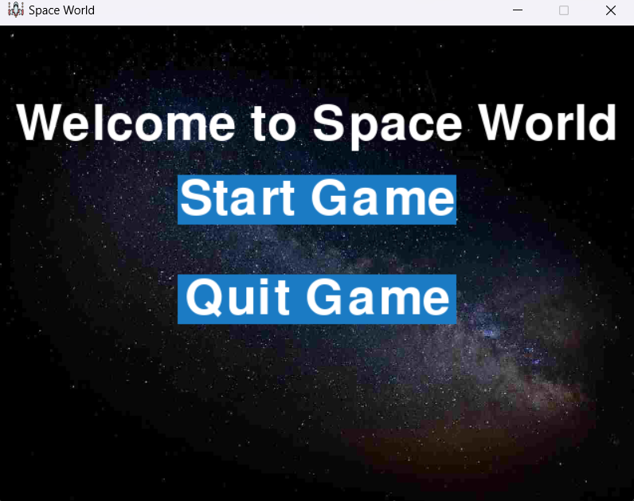
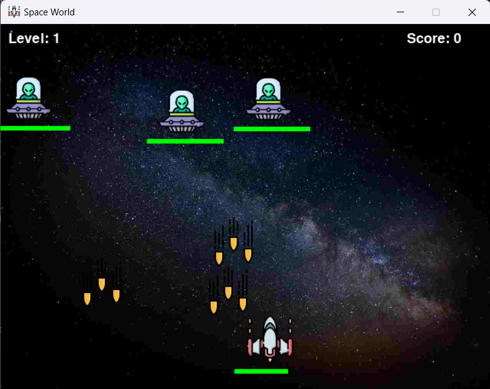
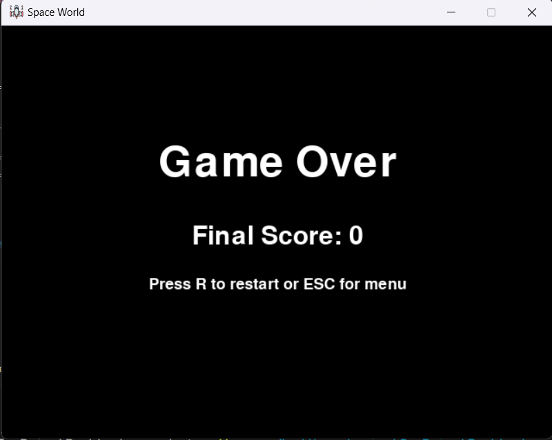

# Space World Game

Welcome to **Space World**, an exciting space-themed game developed using Python and Pygame! In this game, you will navigate through space, defeat enemies, and score points while avoiding enemy bullets.

## Table of Contents

- [Features](#features)
- [ScreenShots](#screenshots)
- [Technologies Used](#technologies-used)
- [Installation](#installation)
- [Game Controls](#game-controls)
- [Assets](#assets)
- [Contributing](#contributing)


## Features

- Main Menu Screen.
- Player control using keyboard inputs.
- Enemy spawning and movement.
- Player health and score tracking.
- Collisions between player bullets and enemies.
- Game over and Game Winning screen with play again option.

## Screenshots
### Main Menu Screen
  
The main menu of the game, featuring interactive buttons with hover sound effects and a welcoming title: **"Welcome to Space World"**.

---

### Gameplay Screen
  
Active gameplay showing the player ship, enemy ships, bullet firing mechanics, and score tracking in real-time.

---

###  Game Over Screen
  
This screen appears when the player loses. It shows a **"Game Over"** message along with the final score and an option to restart or return to the main menu.


## Technologies Used

- Python
- Pygame

## Installation

To run the game locally, follow these steps:

1. Clone the repository:
   ```bash
   git clone https://github.com/saisaurav78/Space_Game.git
   
   cd Space_Game
   
   pip install pygame
   
   python main.py
  
## Game Controls

Use A, D keys to move the player:

A: Move Left
D: Move Right

Press the Space key to shoot bullets at enemies.

If you lose, press R to restart game.

## Assets

The game includes the following assets:

Images:
Player sprite: spacegame/assets/images/player.png
Background: spacegame/assets/images/bg.jpg
Enemy sprite: spacegame/assets/images/ufo.png
Bullet sprite: spacegame/assets/images/bullet.png
Explosion sprite: spacegame/assets/images/blast.png

Sounds:
bullet sound: spacegame/assets/sounds/bullet.mp3
menu sound:spacegame/assets/sounds/menu_select.mp3
explosion sound:spacegame/assets/sounds/explosion.mp3

## Contributing
Contributions are welcome! If you have suggestions or improvements, please open an issue or submit a pull request.

